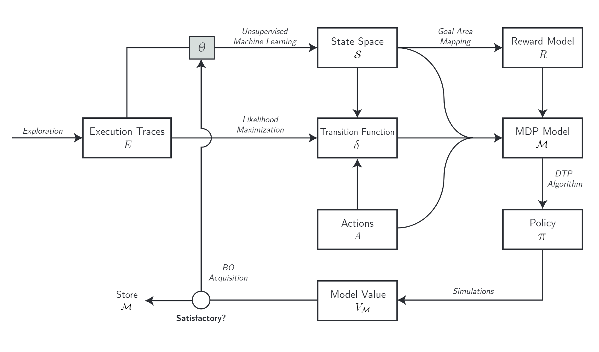

# Learning and Optimizing Probabilistic Models for Planning under Uncertainty

Decision-theoretic planning techniques are increasingly being used to obtain (optimal) plans for domains involving uncertainty, which may be present in the form of the controlling agent’s actions, its percepts, or exogenous factors in the domain.
These techniques build on detailed probabilistic models of the underlying system, for which Markov Decision Processes (MDPs) have become the _de facto_ standard formalism.
However, handcrafting these probabilistic models is usually a daunting and error-prone task, requiring expert knowledge on the domain under consideration.
Therefore, it is desirable to automate the process of obtaining these models by means of learning algorithms presented with a set of execution traces from the system.
Although some work has already been done on crafting such learning algorithms, the state of the art lacks an automated method of configuring their hyperparameters, so to maximize the performance yielded from executing the derived plans.
In this work we present a method that employs the Bayesian Optimization (BO) framework to learn MDPs autonomously from a set of execution traces, optimizing the expected value and performance in simulations over a set of tasks the underlying system is expected to perform.
The approach has been tested on learning MDPs for mobile robot navigation, motivated by the significant uncertainty accompanying the robots’ actions in this domain.

This thesis is available at: [http://resolver.tudelft.nl/uuid:37e80be9-ab78-427b-b317-c5529a752d7d](http://resolver.tudelft.nl/uuid:37e80be9-ab78-427b-b317-c5529a752d7d)
